# Blake3-Golang

High-performance BLAKE3 implemented in idiomatic Go with optional amd64 Go
assembly (SSE4.1/AVX2) for acceleration and a separate C/NASM benchmark harness
aligned with FP_ASM_LIB calling conventions. This is not pure Go on amd64: the
fast path relies on architecture-specific assembly, while other platforms use a
portable Go fallback. This repo targets correctness first, then performance
with hard data and repeatable benchmarks.

Reference spec and upstream implementation:
https://github.com/BLAKE3-team/BLAKE3

## Highlights
- Go API that mirrors the standard hash.Hash patterns plus BLAKE3 XOF output.
- Streaming support with progress callbacks for large inputs.
- SSE4.1 row-based compression on amd64 for short inputs.
- AVX2-accelerated chunk hashing and parent reduction on amd64 (Go assembly).
- Parallel chunk hashing for large inputs in Sum256 on amd64.
- C/NASM AVX2 8-way compressor for FP_ASM_LIB-style benchmarking.
- Portable Go fallback for non-amd64 or without SIMD; the fastest path is
  amd64-only and uses Go assembly.

## Quick start (Go)
```go
package main

import (
    "fmt"
    "github.com/TACITVS/Blake3-Golang/blake3"
)

func main() {
    sum := blake3.Sum256([]byte("hello"))
    fmt.Printf("%x\n", sum)
}
```

## Streaming with progress
```go
package main

import (
    "fmt"
    "github.com/TACITVS/Blake3-Golang/blake3"
)

func main() {
    sum, err := blake3.HashFile("big.bin", 256*1024, func(p blake3.Progress) {
        fmt.Printf("processed=%d total=%d elapsed=%s\n", p.Processed, p.Total, p.Elapsed)
    })
    if err != nil {
        panic(err)
    }
    fmt.Printf("%x\n", sum)
}
```

For streaming a reader directly, use:
```go
h := blake3.New()
_, err := h.WriteReader(r, nil, totalBytes, onProgress)
```

## Benchmarks
Machine (10-run averages; `tools/bench/compare_all.ps1`):
- OS: Microsoft Windows 10 Pro
- CPU: Intel(R) Core(TM) i7-4600M CPU @ 2.90GHz
- Cores: 4
- RAM: 15.69 GB
- Go: go1.24.7 (windows/amd64)
- GOOS/GOARCH: windows/amd64
- GOMAXPROCS: default (Go runtime)
- GCC: C:\msys64\mingw64\bin\gcc.exe
- NASM: C:\Users\baian\AppData\Local\bin\NASM\nasm.exe

Method:
- Go asm: `go test ./blake3 -run=^$ -bench=Benchmark -benchmem`
- Go purego: `go test -tags purego ./blake3 -run=^$ -bench=Benchmark -benchmem`
- Ref C: `tools/ref_bench/run.ps1` (official BLAKE3)
- FP C: `tools/fp_bench/run.ps1` (FP_ASM_LIB-style NASM path)

Results (MB/s, avg/min/max/std, relative vs Ref C):
| Version | Size | Avg MB/s | Min | Max | Std | Rel vs Ref |
| --- | --- | --- | --- | --- | --- | --- |
| Ref C | 1K | 712.03 | 588.71 | 806.68 | 61.72 | -% |
| Ref C | 8K | 2496.84 | 2037.87 | 2793.2 | 253.99 | -% |
| Ref C | 1M | 2596.34 | 2307.44 | 2993.69 | 196.15 | -% |
| Go asm | 1K | 552.87 | 493.46 | 606.65 | 37.88 | -22.35% |
| Go asm | 8K | 2080.36 | 1717.79 | 2290.6 | 184.71 | -16.68% |
| Go asm | 1M | 3367.82 | 2333.41 | 3954.17 | 457.06 | 29.71% |
| Go purego | 1K | 115.57 | 75.58 | 142.33 | 25.81 | -83.77% |
| Go purego | 8K | 122.6 | 81.82 | 147.03 | 21.95 | -95.09% |
| Go purego | 1M | 128.76 | 104.25 | 142.37 | 11.37 | -95.04% |
| FP C | 1K | 165.74 | 129.34 | 204.97 | 23.3 | -76.72% |
| FP C | 8K | 277.44 | 223.34 | 326.1 | 26.57 | -88.89% |
| FP C | 1M | 1160.82 | 851.89 | 1339.34 | 147.14 | -55.29% |

```mermaid
xychart-beta
  title "BLAKE3 Throughput (MB/s)"
  x-axis ["1K", "8K", "1M"]
  y-axis "MB/s" 0 --> 3400
  bar "Ref C" [712.03, 2496.84, 2596.34]
  bar "Go asm" [552.87, 2080.36, 3367.82]
  bar "Go purego" [115.57, 122.6, 128.76]
  bar "FP C" [165.74, 277.44, 1160.82]
```



Note on Go `B/op` and `allocs/op`: Sum256 uses small temporary buffers and
spawns goroutines for large inputs, so you may see small allocations there;
streaming Hasher.Write remains allocation-free.

## Interactive charts (GitHub Pages)
The repo ships a static benchmark dashboard in `docs/`. It renders charts from
`docs/data/bench.json` (also mirrored as `docs/data/bench.js` for no-fetch use).
Enable GitHub Pages with the `docs/` folder to use it.

To refresh the data locally:
```powershell
cd C:\Users\baian\GOLANG\Blake3-Golang
tools\bench\collect_all.ps1
```

## Design notes and tradeoffs vs the reference implementation
- Go implementation uses AVX2 for chunk batching and parent reduction, with
  parallel chunk hashing for large inputs in Sum256; the streaming Hasher
  remains single-threaded for predictable incremental behavior.
- The Go SIMD paths are Go assembly optimized for the Go ABI; no cgo is used,
  but the accelerated code is architecture-specific, with a portable Go
  fallback on other platforms.
- The reference C implementation is more aggressively tuned (wider SIMD, tighter
  scheduling, and multiple dispatch paths). It remains the peak-performance
  baseline on this CPU.
- The FP_ASM_LIB NASM path is intentionally ABI-clean and uses the library's
  standard prologue/epilogue, favoring portability and integration over absolute
  throughput. It uses 8-way SIMD with a loop-free C harness; small inputs can
  pay a setup/transpose tax, while large inputs see higher throughput.

## API overview
- `Sum256(data []byte) [32]byte`
- `Sum(data []byte, out []byte)` (XOF)
- `SumKeyed(key [32]byte, data []byte) [32]byte`
- `DeriveKey(context string, out []byte)`
- `New()` / `NewKeyed(key)` / `NewDeriveKey(context)`
- `Hasher.Write`, `Hasher.Sum`, `Hasher.Sum256`, `Hasher.Finalize`
- Streaming helpers in `blake3/stream.go` for progress reporting

## Running benchmarks locally
Go:
```powershell
cd C:\Users\baian\GOLANG\Blake3-Golang
go test ./blake3 -run=^$ -bench=Benchmark -benchmem
```

10-run all-versions comparison:
```powershell
cd C:\Users\baian\GOLANG\Blake3-Golang
tools\bench\compare_all.ps1
```

FP_ASM_LIB C benchmark (NASM + GCC):
```powershell
cd C:\Users\baian\GOLANG\Blake3-Golang
tools\fp_bench\run.ps1
```

Reference C benchmark (upstream BLAKE3):
```powershell
cd C:\Users\baian\GOLANG\Blake3-Golang
tools\ref_bench\run.ps1
```

The reference benchmark expects upstream sources at:
`C:\Users\baian\GOLANG\_ref\BLAKE3\c`

## Project layout
- `blake3/`: Go implementation (portable core + amd64 assembly for SSE4.1/AVX2).
- `tools/fp_bench/`: C/NASM bench harness using FP_ASM_LIB-style AVX2.
- `tools/ref_bench/`: benchmark harness for upstream reference C.
- `tools/bench/`: interleaved Go vs reference benchmark script.

## Status
Correctness tests pass for the Go and C paths. Performance is measured and
tracked; short-input throughput still trails the reference baseline on this CPU
while large inputs exceed it.

## License
MIT. See `LICENSE`.
